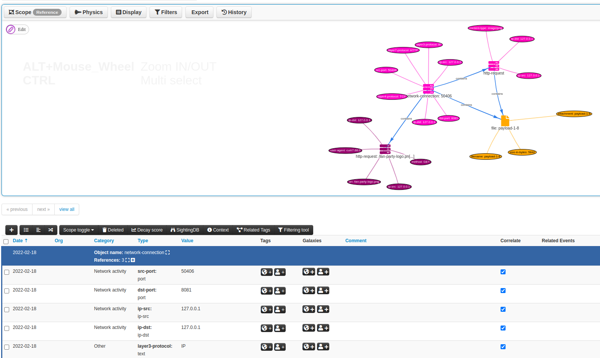

# misp-wireshark

`misp-wireshark` is a Lua plugin intended to help analysts extract data from Wireshark and convert it into the [MISP Core format](https://www.misp-project.org/datamodels/)

[](https://youtu.be/B7xs5SwhlTA)

## Usage

### Wireshark

1. Go to `Tools` located in Wireshark's top bar and click on `MISP: Export to MISP format`
2. Enter the export options to configure the behavior of the exporter
    - 
    - `Main filter`: Fill this field to filter the exported data. Essentially, it will just be a copy/paste from the global filter in the interface. (This cannot be done automatically because of [this](https://github.com/MISP/misp-wireshark/blob/89578d5c0eac9a23dc6f60afe223996ee0e50e32/misp-wireshark.lua#L70))
    - `Include HTTP payload`: Should the payloads sent via HTTP be included as a file in the output
    - `Export path`: The location where the exported file should be saved when clicking on `Save to file`
    - `Tags`: Optional tags can be attached to some MISP attributes. 
3. Copy or save in a file the data to be imported in MISP
    - 
4. Import in MISP
    - 

### Tshark
Command-line options are the same parameters as in the user interface:
- `filters`: The filter expression to be applied
- `include_payload`: Should potentials payload be also exported. Accept `y` or `n`
- `export_path`: The folder under which the json should be saved. If not supplied, default to stdout
- `tags`: Optional tags to be attached to some MISP attributes


**Example**

```bash
tshark \
    -r ~/Downloads/capture.cap \
    -X lua_script:/home/john/.local/lib/wireshark/plugins/misp-wireshark/misp-wireshark.lua \
    -X lua_script1:filters="ip.addr == 127.0.0.1" \
    -X lua_script1:include_payload=n \
    -X lua_script1:tags="tlp1,tlp2" \
    frame.number == 0
```
*Note: As we did not supply an export path, the result is printed on stdout. However, to avoid mixing both the plugin output and tshark output, we provide a filter to tshark that will filter out every packets.*

## Installation

On linux, clone the repository in wireshark's plugin location folder

```bash
mkdir -p ~/.local/lib/wireshark/plugins
cd ~/.local/lib/wireshark/plugins
git clone https://github.com/MISP/misp-wireshark 
cd misp-wireshark/
git submodule update --init --recursive
```

## Updates

```bash
git pull
git submodule update
```


## Notes about `community-id`
:warning: In order for this plugin to use [community-id](https://github.com/corelight/community-id-spec), wireshark must be at version 3.3.1 or higher.

By default, `community-id` is disabled. To enable it, you have to perform these steps:
1. On the top bar go to `Analyze/Enabled Protocols...`
2. Search for `CommunityID` in the list
3. Check the checkbox


## Exports supported in MISP object format

- [`network-connection`](https://www.misp-project.org/objects.html#_network_connection) from tcp
- [`http-request`](https://www.misp-project.org/objects.html#_http_request) from tcp.http, including HTTP payloads
- [`dns-record`](https://www.misp-project.org/objects.html#_dns_record) from udp.dns
