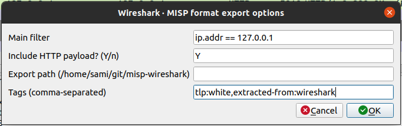
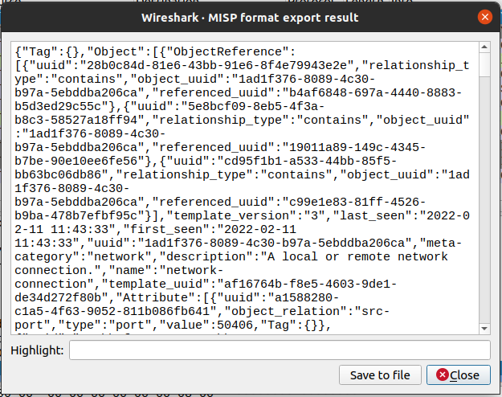

# misp-wireshark
`misp-wireshark` is a Lua plugin intended to help analysts extract data from Wireshark and convert it into the [MISP Core format](https://www.misp-project.org/datamodels/)

## Usage
1. Go to `Tools` located in Wireshark's top bar and click on `MISP: Export to MISP format`
2. Enter the export options to configure the behavior of the exporter
    - 
    - `Main filter`:
    - `Include HTTP payload`:
    - `Export path`:
    - `Tags`:
3. Copy or save in a file the data to be imported in MISP
    - 
4. Import in MISP

## Installation
On linux, clone the repository:
```bash
mkdir ~/.local/lib/wireshark/plugins
cd ~/.local/lib/wireshark/plugins
git clone https://github.com/MISP/misp-wireshark 
git submodule update --init --recursive
```

## Updates
```bash
git pull
git submodule update
```

:warning: In order for this plugin to use [community-id](https://github.com/corelight/community-id-spec), wireshark must at version 3.3.1 or higher


## Exports supported
- [`network-connection`](https://www.misp-project.org/objects.html#_network_connection) from tcp
- [`http-request`](https://www.misp-project.org/objects.html#_http_request) from tcp.http, including HTTP payloads
- [`dns-record`](https://www.misp-project.org/objects.html#_dns_record) from udp.dns
